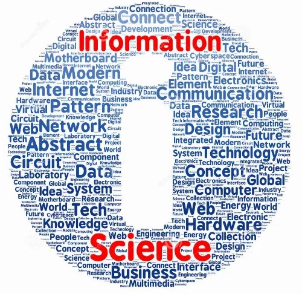
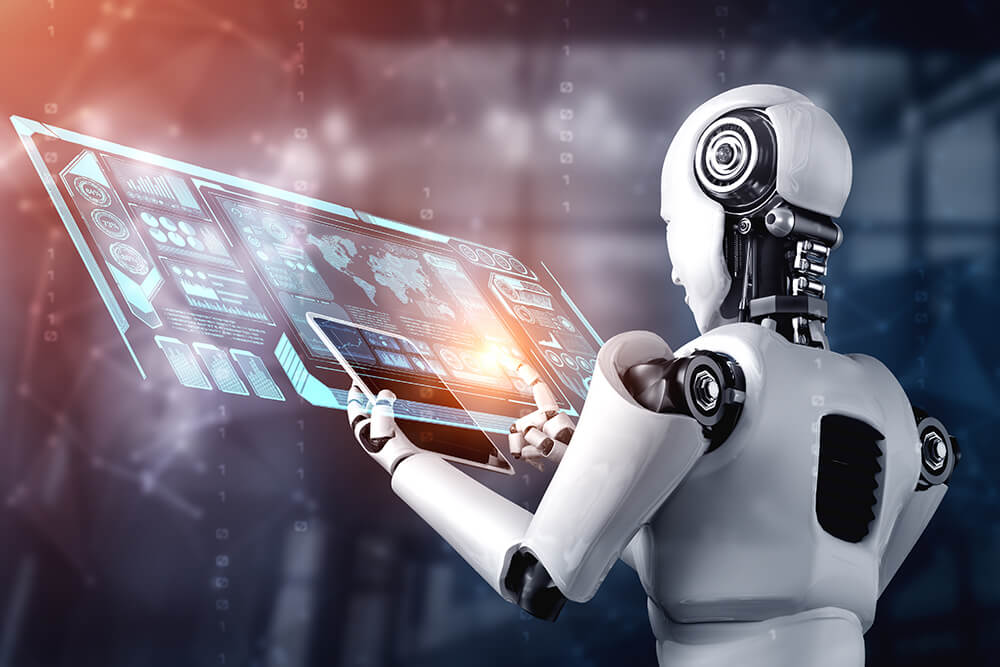
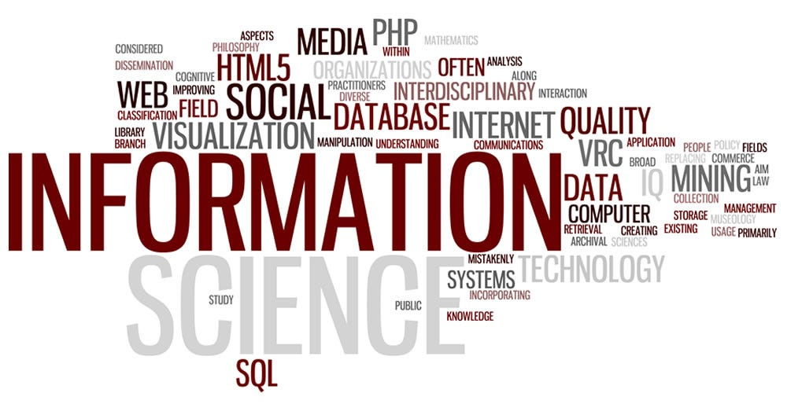

<!-- - [ABOUT](/about) -->
<!-- - [MODULE AND ADMISSION RESOURCES](/module-and-admission-requirements) -->
<!-- - [ON-CAMPUS RESOURCES](/on-campus-resources) -->
<!-- - [ADMINISTARTIVE RESOURCES](/administrative-resources) -->
<!-- - [ACCOMODATION RESOURCES](/tuks-accomodation) -->
<!-- - [CAREERS](/career-possibilities) -->

Welcome to the "One-Stop Information Hub for 1st Year Information
Science Students." Our user-friendly website offers a wealth of
essential features and functionalities designed to help you navigate
your bachelor's of Information Science program effectively. Our hub
covers a rage of resources from course requirements and resources,
academic tools, on-campus resources, administrative resouces,to career
prospects and oppurtunities.

Join us on this exciting journey through your Information Science
education. Our goal is to empower you with the knowledge and resources
you need to not only succeed academically but also thrive in your future
career in the dynamic field of Information Science. Welcome to your
One-Stop Information Hub, where your success is our priority.

<!--  -->

1. [Meet Your Educators](/meet-your-lecturers)
1. [clickUP Help](https://eduvation.up.ac.za/students/index.php/get-started/ultra-navigation)
1. [Useful Tips](/useful-student-tips)

<!--  -->
<!--  -->

<!--  -->
