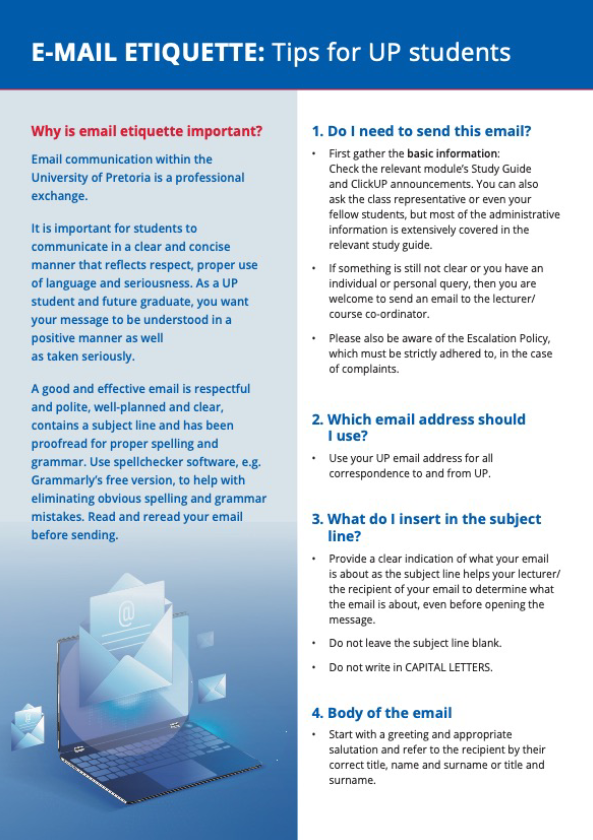

- [STUDENT- DEVELOPMENT MODEL](assets/docs/student-development-model.pdf)
- [UP_EBIT_FAQ.pdf](assets/docs/up_ebit_faq.pdf)
- [BIS Strategies for academic writing](/assets/docs/BIS Strategies for academic writing.docx)
- [BIS Study, Time management & Note Taking Tips](/assets/docs/BIS Study, Time management & Note Taking Tips.docx)
- [Strategies for Academic writing picture](/assets/docs/Strategies for Academic writing picture.jpg)
- [Time management & Note Taking Tips picture](/assets/docs/Study, Time management & Note Taking Tips picture.jpg)

 

